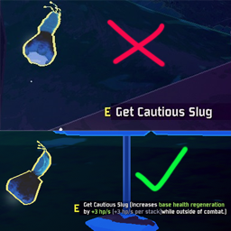

# Pickup Item Description Mod

## Description

Adds the item descriptions in the pickup prompt.

Example (top is vanilla, bottom is the mod):

## Future development

I would like to make the prompt bigger and floating on-screen in front of the item, similar to Borderlands.

## Installation

1. Make sure you have BepInEx installed (https://thunderstore.io/package/bbepis/BepInExPack/)

2. Download the `PickupItemDescription/` folder in this repo (in contains the `PickupItemDescription.dll`)

3. Place the `PickupItemDescription/` folder into your `BepInEx/plugins` folder (ex: `C:\Users\USER\AppData\Roaming\Thunderstore Mod Manager\DataFolder\RiskOfRain2\profiles\PROFILE_NAME\BepInEx\plugins`)

4. Run your modded instance of the game

*Note: The `PickupItemDescriptionPlugin.cs` is the source code for the .dll, it is not needed. It's highly commented for educative purposes.

## Changelog

### 1.0.0

- Initial release

## Contact

Leave any issues and comments on the Github repo:

https://github.com/haddad-github/Pickup-Item-Descriptions-RoR2-Mod